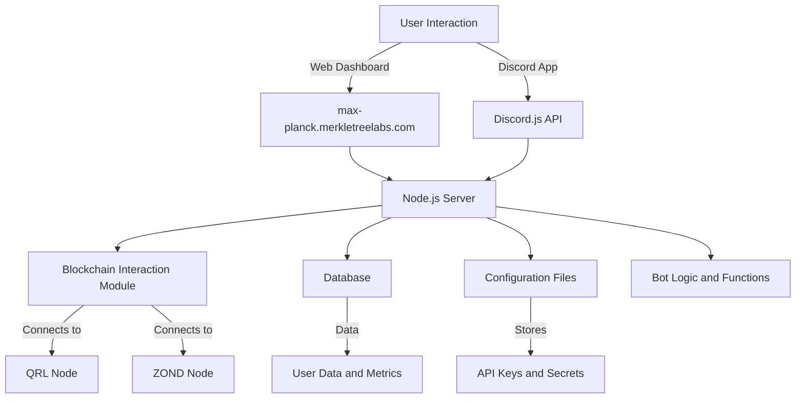

Title:   Max Planck
Summary: Documentation for the Max Planck Discord Bot.
Authors: James Gordon
Date:    October 17, 2024

# Max Planck [](https://www.gnu.org/licenses/agpl-3.0)   
[](https://discord.gg/Uq3XS2HEXA)  [](http://commitizen.github.io/cz-cli/)       

---

The Max Planck Discord bot is built in JavaScript primarily utilizing the express api and discord JS, along with multiple other packages to make this all function.

> [!NOTE] Documentation for the Max Plank Discord Bot
>> This documentation covers technical installation, configuration and deployment of the bot as well as advanced developer documentation and API information.
>
> For information on adding the bot to your guild, or how to interact with the bot you want the user documentation hosted at [Max-Planck.MerkleTreeLabs.com/Docs](https://Max-Planck.merkletreelabs.com/docs)


> [!NOTE] Help and Support
> 
> A brief overview is provided below, otherwise details can be found in the sidebar. Please read the docs, use the search, and if you still have issues join the Discord and chat us up!
> 
><iframe src="https://discord.com/widget?id=1291526783031574661&theme=dark" width="100%" height="200" allowtransparency="true" frameborder="0" sandbox="allow-popups allow-popups-to-escape-sandbox allow-same-origin allow-scripts"></iframe>

---

## General Flow




```
/home/fr1t2/
	└── zond-bot
		├── docs
		├── package.json
		├── README.md
		└── src
			├── api
			│   ├── routes
			│   └── server.js
			├── bots
			│   └── discord
			├── config.json.example
			├── emojiCharacters.js
			├── helpers.js
			├── rules.js
			├── scripts
			│   ├── service_files
			│   └── startup
			├── services
			│   ├── chain
			│   └── database
			└── swaggerConfig.js
```


## Bot Setup

Setting up the bot is complex and multifaceted. We have broken these into multiple documents to make this a little easier. Please follow each step and ensure that the full instruction is complete as they are all required.

### Hosting Server

This guide is written with the entire project ran from a VPS or single server hosted somewhere that is powerful enough for all of the functions we need to operate. This curently sits at 8Gb of RAM and 300Gb NVMe vps with 4 cores.

This server will need to be connected to the net so hardening steps are required for security practices.
### Node's

#### Zond

A full archive Zond node is required for chain lookup functions past a few months. This requires additional bandwidth, drive space and ram to run as it syncs and keeps all blocks in the chain.

The Zond node is 2 packages working together, consensus and validation. We need to run both Go-Zond and Qrysm on this server.

#### QRL

To access the legacy functionality of the old TipBot, Max Planck will need access to the QRL chain as well. This includes syncing the node and storing all of the chain in storage. At the time of writing it was close to 20Gb in size.

Max Planck will utilize the extensible wallet functionality that comes with the `walletd-rest-proxy` and the `walletd`
